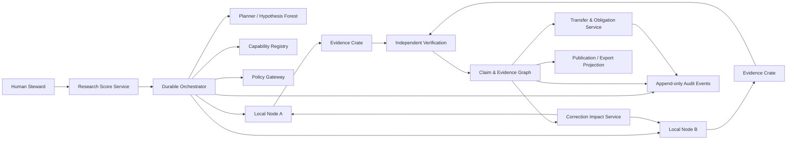

# Meridian Research Runtime — Consolidated Specification v0.1.1
> Generated from the modular specification files in this package. The modular files remain easier to use for bounded coding-agent context.


---

<!-- Source: README.md -->

# Meridian Research Runtime (MRR) — Implementation Specification v0.1.1

This repository-ready specification defines a new practice and software system for federated, auditable, evidence-first research automation.

## Strategic decision

The existing Meridian implementation is not rewritten in place or decommissioned by default. Its current state is sealed as an immutable baseline, while the operational system may continue to run and evolve as `meridian-classic`. The new system is provisionally named **Meridian Research Runtime (MRR)** and begins in shadow, challenger, and selected dual-run modes. Capability adoption is evidence-based, reversible, and does not imply a whole-system sunset.

The governing rule is:

> History is immutable. Policies, constitutions, workflows, and architecture are deliberately mutable through versioned amendments.

## What this package is

This package is the source material from which Codex, Claude Code, or human developers can implement MRR through bounded, testable work packets. It is intentionally more precise than a product brief and less implementation-specific than a finished codebase.

A specification cannot guarantee a perfect implementation. MRR therefore replaces ambiguous expectations with:

- normative requirements using MUST, SHOULD, and MAY;
- explicit domain contracts and state machines;
- machine-validatable JSON Schemas;
- hard safety and provenance invariants;
- benchmark fixtures and release gates;
- one-task-per-change instructions for coding agents;
- architecture decision records and migration rules.

## Reading order for coding agents

1. `AGENTS.md`
2. `docs/00_VISION_AND_GOVERNANCE.md`
3. `docs/01_SYSTEM_SPEC.md`
4. `docs/02_DOMAIN_MODEL.md`
5. `docs/03_API_AND_EVENTS.md`
6. `docs/04_SECURITY_AND_POLICY.md`
7. `docs/05_EVALUATION_AND_ACCEPTANCE.md`
8. `docs/06_IMPLEMENTATION_PLAN.md`
9. `docs/07_AGENT_TASK_TEMPLATE.md`
10. all accepted files in `docs/adr/`, especially `ADR-0002-PARALLEL-OPERATION.md`
11. `schemas/` and `examples/`

If documents conflict, the following precedence applies:

1. accepted ADR;
2. normative requirement with an `MRR-*` identifier;
3. JSON Schema;
4. examples;
5. explanatory prose.

No coding agent may silently resolve a conflict. It must stop the affected task, cite the conflict, and propose an ADR or specification amendment.

## Recommended first implementation slice

The first vertical slice is single-node and intentionally small:

1. create and approve a `ResearchScore`;
2. offer and accept a `TaskBundle` locally;
3. run a deterministic sandbox task;
4. seal an `EvidenceCrate`;
5. create one supported and one contested `Claim`;
6. run an independent verification;
7. open a correction and propagate `review_required` to dependants;
8. export a minimal RO-Crate-compatible bundle.

Federation, LLM-driven hypothesis generation, qualitative field mode, and publication projections are added only after this slice passes all hard gates.

## Working names

- Practice: `Meridian Research Runtime`
- Repository: `meridian-runtime`
- Parallel operating system: `meridian-classic`
- Immutable comparison baseline: `meridian-classic-baseline-2026-07`
- CLI: `mrr`
- API namespace: `/v1`
- Object namespace: `urn:mrr:<entity>:<ulid>`

Names are provisional and may change through an ADR without changing the conceptual contracts.

---

<!-- Source: AGENTS.md -->

# Instructions for Codex, Claude Code, and other coding agents

## Mission

Implement Meridian Research Runtime strictly from the specification. Prefer correctness, auditability, explicit failure, and small reversible changes over speed or apparent completeness.

## Non-negotiable rules

1. Read the relevant specification sections before changing code.
2. Implement only one approved task packet at a time.
3. Do not invent domain behavior that is absent from the specification.
4. Do not weaken a MUST requirement to make a test pass.
5. Every change MUST include tests at the appropriate level.
6. All externally visible data structures MUST be schema-validated.
7. No model output may directly become authoritative state.
8. No executor may approve or verify its own result.
9. No cross-practice object may be accepted without signature and hash verification.
10. No raw restricted or participant-identifiable data may leave its owning node by default.
11. No privileged containers, unpinned dependencies, unrestricted network egress, or secrets in prompts.
12. Do not leave placeholders, silent exception handling, fake implementations, or TODO-only branches in merged code.
13. Do not modify files outside the task packet's allowed paths without reporting a blocking dependency.
14. If a requirement is ambiguous, create a specification issue or ADR proposal; do not guess.
15. Sealing the Meridian Classic baseline is not permission to stop, mutate, or replace the live Classic system. Such actions require an explicit capability-specific task and accepted decision record.

## Required delivery format

Every implementation response or pull request MUST contain:

- task identifier;
- concise implementation summary;
- files changed;
- migrations added;
- tests added or changed;
- exact commands executed and their results;
- security or privacy implications;
- known limitations;
- any specification conflict discovered.

## Engineering defaults

Unless superseded by an ADR:

- Python 3.12+
- FastAPI for HTTP interfaces
- Pydantic v2 for runtime contracts
- PostgreSQL for authoritative metadata and graph edges
- S3-compatible object storage for content-addressed artifacts
- Temporal for durable workflows
- OCI containers for sandbox tasks
- OpenTelemetry for traces
- pytest, hypothesis, and contract tests
- Ruff and mypy in strict mode
- Alembic for database migrations

## Commands expected in the eventual repository

The implementation MUST converge on these stable commands:

```bash
make format
make lint
make typecheck
make test
make test-contract
make test-integration
make test-e2e
make benchmark
make security-check
```

A task is not complete if the relevant commands fail.

## Source-of-truth discipline

- Database state is authoritative for current materialized state.
- The append-only domain event log is authoritative for audit history.
- Object storage is authoritative for sealed artifact bytes.
- Git is authoritative for code, schemas, prompts, policies, and specification versions.
- Narrative reports are projections and are never the primary research record.

## Prohibited shortcuts

- storing mutable blobs without content hashes;
- using an LLM confidence number as epistemic confidence;
- counting copied sources as independent evidence;
- letting an agent cite a source it did not retrieve and anchor;
- automatic publication or participant contact;
- collapsing `unknown`, `not_found`, `contradicted`, and `failed` into one generic error;
- silently overwriting prior object revisions;
- using a graph database before PostgreSQL graph edges are proven insufficient.

---

<!-- Source: docs/00_VISION_AND_GOVERNANCE.md -->

# 00 — Vision and governance

## 1. Product definition

Meridian Research Runtime is a federated research operating system that transforms an approved research brief into a traceable network of hypotheses, tasks, runs, evidence, counterevidence, claims, reviews, transfers, obligations, and corrections.

Its primary output is not a paper. Its primary output is an **auditable evidence and claim graph** from which papers, reports, datasets, notebooks, and public summaries can be projected.

## 2. Mission

MRR MUST enable human and machine researchers to coordinate complex research while preserving:

- local control over data and actions;
- exact provenance from claim to source or run;
- independent criticism and verification;
- explicit uncertainty, failure, and non-knowledge;
- the possibility of legitimate disagreement;
- correction propagation without central epistemic coercion;
- reversible institutional and technical evolution.

## 3. Governing principles

### P-01 — Immutable history, mutable constitution

Past states, decisions, runs, and artifacts MUST remain auditable. Policies, constitutions, role definitions, and workflows MAY be amended through versioned changes.

### P-02 — Evidence before narrative

Narratives MUST be generated from claims and evidence, not used as the authoritative source from which claims are reconstructed.

### P-03 — Local sovereignty

A practice or node MUST be able to refuse, narrow, modify, defer, or require approval for a task. The control plane MUST NOT bypass local policy.

### P-04 — Deterministic contracts, stochastic internals

Agent reasoning may be probabilistic. Interfaces, schemas, state transitions, permissions, and acceptance tests MUST be deterministic and machine-validatable.

### P-05 — Independence by construction

Proposal, execution, criticism, verification, and publication approval MUST be separated by role and permission. Independent verification cannot be simulated by repeatedly asking the same agent to reconsider its own output.

### P-06 — Failure is data

Null results, refusals, errors, unavailable sources, underpowered analyses, unresolved disagreements, and withdrawn claims MUST be preserved as first-class research records.

### P-07 — Least agency

Every component receives the minimum actions, data, network access, budget, and duration necessary for its task. Autonomy is capability-specific, not a global on/off setting.

### P-08 — Correction is normal operation

Correction is not an exceptional embarrassment. It is a standard domain event with impact analysis, notification, local response, and visible unresolved obligations.

### P-09 — Replaceability

No model vendor, workflow engine, vector database, publication format, or user interface may become the sole holder of research semantics.

### P-10 — No hidden convergence

The system MUST NOT silently collapse competing interpretations into one consensus. Synthesis must preserve material dissent, scope differences, and unresolved branches.

### P-11 — Parallel operation and empirical revision

MRR MUST NOT presume that a new architecture should replace a working research practice. Meridian Classic MAY continue to operate and evolve while MRR runs in shadow, challenger, or dual-run modes. Adoption decisions MUST be based on attributable comparative evidence and MAY be made capability by capability in either direction.

## 4. Scope for v1

MRR v1 covers:

- literature and document research;
- computational and data-analysis workflows;
- federated execution against locally governed nodes;
- evidence anchoring and claim lifecycle management;
- independent verification and correction propagation;
- qualitative field-research support in human-led or shadow mode;
- export of portable research objects and narrative projections.

## 5. Explicit non-goals for v1

MRR v1 MUST NOT:

- autonomously publish externally;
- autonomously contact research participants;
- replace ethics review, consent, or institutional authority;
- centralize raw sensitive field data by default;
- treat model-generated synthetic participants as empirical evidence;
- guarantee truth from reviewer scores or model confidence;
- operate physical laboratory devices without a separately approved safety architecture;
- optimize for paper count, novelty score, or citation count as a primary success metric.

## 6. Parallel operation and adoption policy

The immutable baseline and the live Meridian Classic system are separate concepts. Sealing a baseline preserves a comparison point; it does not suspend operation, development, or authoritative work in Meridian Classic.

- **MRR-GOV-021**: Creating MRR MUST NOT automatically decommission, pause, or prohibit further development of Meridian Classic.
- **MRR-GOV-022**: A content-addressed Meridian Classic baseline MUST be sealed before material comparative claims are made, while subsequent Classic runs and changes MUST remain attributable to exact versions and configurations.
- **MRR-GOV-023**: Meridian Classic and MRR MUST be executable in parallel for defined benchmark, pilot, or challenger tasks where data rights and operational constraints permit.
- **MRR-GOV-024**: Comparative results MUST identify the exact system version, policy profile, model/tool configuration, input snapshot, resource envelope, and evaluation rubric for each side.
- **MRR-GOV-025**: Migration or adoption decisions MUST be capability-specific, reversible, and supported by documented evaluation evidence. A whole-system cutover is never implied.
- **MRR-GOV-026**: Meridian Classic MAY remain indefinitely as an independent production, challenger, red-team, replication, or fallback practice.
- **MRR-GOV-027**: Material changes to either system MUST be versioned; no improvement or regression claim may combine results from materially different configurations without disclosure.
- **MRR-GOV-028**: Continued operation of Meridian Classic MUST NOT cause imported Classic claims to be treated as verified MRR claims. Imports remain `legacy_unverified` until they satisfy MRR evidence and verification contracts.

Three comparative operating modes are recognized:

1. **Baseline dual run**: both systems independently address the same bounded research assignment under as comparable a resource envelope as practical.
2. **Challenger run**: one system performs the primary task and the other concentrates on counterevidence, numeric checks, source-family analysis, correction discovery, or alternative hypotheses.
3. **Exploratory run**: one system investigates a materially different method or problem framing; results are compared for complementarity rather than ranked as if conditions were identical.

A task MAY remain in one system only. Parallel execution is required for selected evaluation cases, not for every production request.

## 7. Constitutional amendment protocol

Every amendment MUST include:

1. unique ADR or RFC identifier;
2. exact text or schema diff;
3. rationale and evidence;
4. affected requirements, objects, and migrations;
5. expected benefits and failure modes;
6. benchmark changes;
7. rollout and rollback procedure;
8. effective version and date;
9. human approver or approved governance process.

A constitution or policy change MUST NOT rewrite historical records. Existing runs retain the policy version under which they were executed.

## 8. Governance roles

- **Steward**: approves research scores, high-impact actions, releases, and amendments.
- **Planner/Proposer**: creates hypotheses, branch plans, and task proposals.
- **Executor**: performs approved tasks in a sandbox or local environment.
- **Skeptic**: searches for counterevidence, hidden assumptions, and alternative explanations.
- **Verifier**: independently checks sources, calculations, and reproducibility.
- **Chronicler**: seals artifacts, records state transitions, and validates provenance completeness.
- **Policy Authority**: evaluates local legal, ethical, data, and operational rules.
- **Methodologist**: reviews design validity and statistical or qualitative method fit.
- **Participant/Data Steward**: controls field-research data rights, withdrawals, and disclosure.

A natural person may hold multiple organizational roles, but the same execution principal MUST NOT both create and independently verify the same claim.

## 9. Success definition

MRR succeeds when it reduces unsupported certainty, preserves useful divergence, makes correction cheap and visible, and enables research work to move between autonomous practices without losing provenance or obligations.

It does not succeed merely because it produces fluent reports or completes many tasks.

---

<!-- Source: docs/01_SYSTEM_SPEC.md -->

# 01 — System specification

## 1. Normative language

`MUST`, `MUST NOT`, `SHOULD`, `SHOULD NOT`, and `MAY` are normative. Every normative requirement has a stable identifier. A release may not claim conformance while knowingly violating a MUST requirement.

## 2. System boundary

MRR is divided into a control plane and independently governed data-plane nodes.

### 2.1 Control plane

The control plane coordinates work and stores only the information permitted by participating practices. It contains:

1. Research Score Service
2. Workflow Orchestrator
3. Capability Registry
4. Policy Decision Gateway
5. Claim and Evidence Graph
6. Review and Verification Service
7. Transfer and Obligation Service
8. Correction Impact Service
9. Audit/Event Log
10. Export/Projection Service
11. Observability and Cost Ledger

### 2.2 Data plane

Each local node contains:

1. Node Manifest and local identity
2. Local policy engine
3. Task inbox and decision interface
4. Sandboxed executor
5. Local data connectors
6. Local artifact store
7. Evidence Crate builder
8. Signed result outbox
9. Optional offline store-and-forward transport

The control plane MUST NOT assume that local data, prompts, logs, or artifacts are globally readable.

## 3. Reference architecture



## 4. Primary end-to-end workflow

### 4.1 Stage 1 — Research Score

A human or authorized practice creates a `ResearchScore` defining the question, scope, non-goals, data classes, allowed methods, budgets, quality gates, and autonomy limits.

- **MRR-FR-001**: Every research run MUST originate from an approved, versioned `ResearchScore`.
- **MRR-FR-002**: A material change to question, scope, data class, autonomy, budget, or publication policy MUST create a new score revision.
- **MRR-FR-003**: A score revision MUST NOT retroactively alter the policy or meaning of completed runs.
- **MRR-FR-004**: The system MUST reject execution when the referenced score is missing, unapproved, expired, or superseded without explicit continuation permission.

Acceptance:

- Creating a run without an approved score returns a deterministic domain error.
- Every run record resolves to the exact score revision and policy bundle used.

### 4.2 Stage 2 — Hypothesis Forest

The planner generates multiple research branches rather than one linear plan.

- **MRR-FR-010**: The planner MUST support at least the branch roles `confirmatory`, `falsification`, `alternative_explanation`, `replication`, `method_independent`, and `insufficient_evidence`.
- **MRR-FR-011**: A score MAY waive a branch role only with a recorded reason.
- **MRR-FR-012**: Each branch MUST declare falsifiable expectations, required capabilities, estimated budget, stop conditions, and dependencies.
- **MRR-FR-013**: Branch prioritization MUST preserve non-selected branches and the reasons for deferral.
- **MRR-FR-014**: The planner MUST NOT mark its own hypothesis as verified.

Acceptance:

- A branch cannot enter execution without stop conditions and an allocated budget.
- Deferred and rejected branches remain queryable.

### 4.3 Stage 3 — Capability discovery and negotiation

- **MRR-FR-020**: Every executable node MUST publish a signed `NodeManifest` containing capabilities, restrictions, accepted inputs, output types, data residency, and approval requirements.
- **MRR-FR-021**: The orchestrator MUST match tasks to capabilities without assuming permission.
- **MRR-FR-022**: The target node MUST make the authoritative accept, modify, defer, or reject decision.
- **MRR-FR-023**: Modified tasks MUST be returned as a new signed revision and explicitly accepted by the origin before execution.
- **MRR-FR-024**: A refusal MUST be preserved as a research event with a reason category and optional human-readable explanation.

Acceptance:

- A node can reject a syntactically valid task for local policy reasons without causing workflow corruption.
- The control plane cannot set a node task to `accepted` on behalf of that node.

### 4.4 Stage 4 — Signed Task Bundle

- **MRR-FR-030**: Every execution MUST be driven by a schema-valid, content-hashed `TaskBundle`.
- **MRR-FR-031**: A cross-practice `TaskBundle` MUST be signed by the origin practice.
- **MRR-FR-032**: The bundle MUST specify purpose, inputs, data access mode, allowed tools, container digest, resources, network policy, output contract, budget, expiry, and approval rules.
- **MRR-FR-033**: Secrets MUST be referenced by local secret identifiers and MUST NOT be embedded in the task payload.
- **MRR-FR-034**: A task revision MUST receive a new content hash and signature.
- **MRR-FR-035**: Task execution MUST be idempotent with respect to the tuple `(task_id, revision, execution_attempt)`.

Acceptance:

- Signature or hash mismatch rejects the task before any data access.
- An expired task cannot start.
- An identical delivery does not create duplicate authoritative runs.

### 4.5 Stage 5 — Local execution

- **MRR-FR-040**: Tasks MUST execute under the target node's local policy and resource controls.
- **MRR-FR-041**: Sandboxed execution MUST default to non-root, read-only base filesystem, explicit writable mounts, bounded CPU/memory/disk/runtime, and deny-by-default network egress.
- **MRR-FR-042**: The executor MUST record an immutable `RunManifest` before sealing outputs.
- **MRR-FR-043**: Failed, cancelled, timed-out, partially completed, and policy-denied runs MUST produce explicit terminal records.
- **MRR-FR-044**: The system MUST distinguish deterministic transformations from stochastic model-assisted operations.
- **MRR-FR-045**: Model invocations MUST use a provider-neutral adapter and record model profile, prompt/configuration hash, tool calls, token usage, and response hash subject to local redaction policy.
- **MRR-FR-046**: A model response MUST be treated as a proposal until domain validation accepts it.

Acceptance:

- A task cannot write outside approved mounts.
- A timeout produces `timed_out`, not generic `failed`.
- Invalid structured model output cannot enter the claim graph.

### 4.6 Stage 6 — Evidence Crate

- **MRR-FR-050**: Every completed or materially failed run MUST produce an `EvidenceCrate` or a signed failure crate.
- **MRR-FR-051**: Every artifact MUST have a media type, byte size, SHA-256 content hash, producer run, creation time, and disclosure classification.
- **MRR-FR-052**: Every source-based evidence item MUST include a resolvable source record and an exact anchor where technically possible.
- **MRR-FR-053**: Every computational result MUST reference inputs, code or workflow version, environment digest, parameters, and output artifacts.
- **MRR-FR-054**: The crate MUST preserve null results, errors, exclusions, and known unknowns.
- **MRR-FR-055**: Crates MUST be exportable in an RO-Crate-compatible form and mappable to W3C PROV relations.
- **MRR-FR-056**: A sealed crate is immutable; corrections create new objects and links rather than altering sealed bytes.

Acceptance:

- Recomputing a sealed artifact hash yields the stored value.
- A supported source claim cannot cite only a bare URL without an evidence anchor or explicit `anchor_unavailable` reason.

### 4.7 Stage 7 — Claim graph

- **MRR-FR-060**: Claims MUST be atomic enough to be independently supported, contested, contradicted, or withdrawn.
- **MRR-FR-061**: Every claim MUST declare type, scope, status, evidence links, counterevidence links, dependencies, uncertainty, and provenance.
- **MRR-FR-062**: A claim with status `supported` MUST have at least one valid support relation and no unresolved hard verification failure.
- **MRR-FR-063**: A claim MAY exist without support only under `draft`, `unsupported`, `unresolved`, or `speculative` status.
- **MRR-FR-064**: The system MUST distinguish `not_found`, `unknown`, `null_result`, `contradicted`, `underpowered`, `method_invalidated`, and `withdrawn`.
- **MRR-FR-065**: Source count MUST NOT be presented as evidence independence. Source families MUST be represented separately.
- **MRR-FR-066**: Materially different scopes or interpretations MUST remain separate claims linked by typed relations rather than merged into vague consensus.

Acceptance:

- The API rejects `supported` without support evidence.
- Two claims with different population or temporal scope cannot be silently deduplicated.

### 4.8 Stage 8 — Skepticism and independent verification

- **MRR-FR-070**: The proposer and executor MUST NOT issue the final verification decision for their own claim.
- **MRR-FR-071**: A verification record MUST declare its independence dimensions: principal, model family, prompt family, retrieval path, code path, and data access path.
- **MRR-FR-072**: Source verification MUST retrieve or locally inspect the cited source and validate the evidence anchor.
- **MRR-FR-073**: Numeric verification MUST recompute the value or explicitly record why recomputation is impossible.
- **MRR-FR-074**: The skeptic MUST search for counterevidence, alternative explanations, scope leakage, and hidden assumptions.
- **MRR-FR-075**: Failed verification MUST change or block claim status according to a deterministic policy.
- **MRR-FR-076**: Repeated judgments from the same model/configuration MUST NOT count as independent reviews.
- **MRR-FR-077**: The system MUST preserve reviewer disagreement and adjudication rationale.

Acceptance:

- A self-verification attempt is rejected.
- A citation verifier that cannot open the source returns `unverified_source_access`, not `verified`.

### 4.9 Stage 9 — Transfer and obligations

- **MRR-FR-080**: A transfer between practices MUST use a versioned `TransferContract` referencing exact source objects by identifier and hash.
- **MRR-FR-081**: The receiving practice MUST respond with `accepted`, `adapted`, `rejected`, `deferred`, or `unresolved`.
- **MRR-FR-082**: Adaptation MUST create a new local object and preserve the relation to the source object.
- **MRR-FR-083**: Obligations, caveats, disclosure limits, attribution, and correction subscriptions MUST travel with the transfer.
- **MRR-FR-084**: A receiving practice MAY reject a correction, but MUST record that it was notified and why it rejected or deferred it.

Acceptance:

- Transferred caveats are visible in every projection unless a local adaptation explicitly changes them with rationale.
- The recipient cannot silently replace the source hash.

### 4.10 Stage 10 — Correction propagation

- **MRR-FR-090**: A correction MUST identify affected objects, reason, severity, evidence, and requested action.
- **MRR-FR-091**: The impact service MUST traverse dependency, derivation, citation, transfer, and publication edges.
- **MRR-FR-092**: Affected claims MUST receive `review_required` or a stricter status without deleting local decisions.
- **MRR-FR-093**: Impact propagation MUST be idempotent and cycle-safe.
- **MRR-FR-094**: Every affected practice MUST receive a signed notification or a durable pending-delivery record.
- **MRR-FR-095**: Public projections MUST display unresolved critical corrections.
- **MRR-FR-096**: A participant data withdrawal MUST invoke the same impact machinery plus retention and deletion policy.

Acceptance:

- A benchmark graph with cycles produces one notification per affected object and no infinite loop.
- Withdrawing a source dataset marks dependent claims for review.

### 4.11 Stage 11 — Projection and publication

- **MRR-FR-100**: Reports, papers, dashboards, and summaries MUST be generated as projections from versioned claim and evidence objects.
- **MRR-FR-101**: A publication bundle MUST include methods, claim table, evidence map, counterevidence, uncertainty, known unknowns, corrections, and provenance summary.
- **MRR-FR-102**: External publication MUST require an A4 human approval event.
- **MRR-FR-103**: The system MUST support internal, partner-restricted, and public disclosure projections.
- **MRR-FR-104**: A narrative generator MUST NOT invent citations or omit material unresolved corrections.

Acceptance:

- Removing a claim from the graph removes it from regenerated projections without altering historical releases.
- An unapproved bundle cannot be published through any first-party connector.

## 5. Autonomy model

Autonomy is assigned per capability and action.

| Level | Name | Permitted actions | Required control |
|---|---|---|---|
| A0 | Observe | retrieve, parse, classify, compare | automated policy validation |
| A1 | Draft | propose hypotheses, protocols, code, questions | clearly marked proposal |
| A2 | Sandbox Execute | run code in isolated local environment | resource and network policy |
| A3 | Federated Execute | send signed bundles to nodes | target-node acceptance |
| A4 | External Act | publish, contact people, release data, control devices | explicit human or dual approval |

- **MRR-FR-110**: A component MUST NOT infer permission for a higher autonomy level from permission at a lower level.
- **MRR-FR-111**: Every external connector MUST declare its autonomy level and approval requirement.
- **MRR-FR-112**: The default for unclassified actions is deny.

## 6. State machines

### 6.1 Research Score

```text
DRAFT -> IN_REVIEW -> APPROVED -> ACTIVE -> SUPERSEDED -> ARCHIVED
             |            |
             v            v
          REJECTED      SUSPENDED
```

Only `APPROVED` and `ACTIVE` revisions may start work. `SUSPENDED` blocks new work but preserves running-work policy according to the suspension decision.

### 6.2 Task Bundle

```text
CREATED -> OFFERED -> ACCEPTED -> QUEUED -> RUNNING -> COMPLETED -> SEALED
                 |       |          |          |           |
                 |       |          |          +-> FAILED  +-> INVALID_RESULT
                 |       |          +-> CANCELLED
                 |       +-> EXPIRED
                 +-> MODIFICATION_PROPOSED -> OFFERED
                 +-> DEFERRED
                 +-> REJECTED
```

### 6.3 Claim

```text
DRAFT -> UNDER_REVIEW -> SUPPORTED
                    |-> CONTESTED
                    |-> CONTRADICTED
                    |-> UNRESOLVED
                    |-> UNSUPPORTED
Any nonterminal status -> REVIEW_REQUIRED
Any status -> WITHDRAWN
Any status -> SUPERSEDED
```

A withdrawn or superseded claim remains addressable.

### 6.4 Correction

```text
OPEN -> IMPACT_ANALYSIS -> NOTIFYING -> AWAITING_RESPONSES -> RESOLVED
                                         |                  |-> PARTIALLY_RESOLVED
                                         |                  |-> REJECTED_BY_RECIPIENT
                                         +-> DELIVERY_PENDING
```

## 7. Required components and responsibilities

### 7.1 Research Score Service

Validates score contracts, approvals, revisions, and policy references.

### 7.2 Durable Orchestrator

Coordinates long-running workflows, retries only idempotent activities, enforces budgets and stop conditions, and never stores hidden agent state as the sole record.

### 7.3 Capability Registry

Stores signed node manifests and compatibility metadata. It does not grant permission.

### 7.4 Policy Gateway

Combines global hard constraints with local node policy. Local policy may be stricter. Policy decisions are recorded as objects.

### 7.5 Node Runtime

Authenticates task bundles, performs local policy evaluation, executes approved work, seals outputs, and signs result crates.

### 7.6 Claim and Evidence Graph

Stores typed nodes and edges in PostgreSQL. A graph database is not required for v1. Recursive queries and materialized views are sufficient until measured otherwise.

### 7.7 Review and Verification Service

Assigns independent reviewers, validates independence, runs deterministic checks, records adjudication, and prevents self-approval.

### 7.8 Correction Impact Service

Computes transitive impact, creates review obligations, and tracks recipient responses.

### 7.9 Projection Service

Builds reports and portable bundles from a fixed graph revision.

## 8. Deployment modes

### 8.1 Local development

Docker Compose MAY run PostgreSQL, MinIO, Temporal, the control plane, and one node runtime.

### 8.2 Single-practice production

One practice runs both planes but MUST preserve logical role and permission separation.

### 8.3 Federated online

Nodes communicate over mutually authenticated channels and exchange signed task and result objects.

### 8.4 Federated offline

Air-gapped or intermittent nodes use signed inbox/outbox bundles. Import and export MUST verify signatures, expiry, replay protection, and object hashes.

## 9. Non-functional requirements

- **MRR-NFR-001 Provenance completeness**: Every authoritative state transition MUST identify actor, timestamp, policy version, causation, correlation, and object revision.
- **MRR-NFR-002 Auditability**: Domain events MUST be append-only and tamper-evident.
- **MRR-NFR-003 Portability**: Core objects MUST be exportable without a proprietary database dump.
- **MRR-NFR-004 Vendor neutrality**: LLM, storage, workflow, and identity providers MUST be behind interfaces.
- **MRR-NFR-005 Resilience**: Node unavailability MUST not corrupt global state; workflows pause or use explicit alternatives.
- **MRR-NFR-006 Privacy**: Raw restricted data MUST remain local unless a specific approved transfer permits export.
- **MRR-NFR-007 Security**: Cross-practice objects MUST be authenticated, authorized, signed, hashed, and replay-protected.
- **MRR-NFR-008 Observability**: Trace identifiers MUST connect score, branch, task, run, model call, artifact, claim, review, transfer, and correction.
- **MRR-NFR-009 Cost control**: Every run and model call MUST be attributable to a score, branch, budget, and practice.
- **MRR-NFR-010 Maintainability**: Core domain logic MUST be separated from frameworks and external adapters.
- **MRR-NFR-011 Accessibility**: Human review interfaces SHOULD expose provenance, uncertainty, and correction status without requiring database access.
- **MRR-NFR-012 Explicit degradation**: Missing models, connectors, or nodes MUST produce explicit degraded states rather than fabricated substitutes.

## 10. Technology baseline

The initial implementation SHOULD use:

- Python 3.12 or newer;
- FastAPI and Pydantic v2;
- PostgreSQL with JSONB and explicit edge tables;
- S3-compatible content-addressed object storage;
- Temporal for durable workflows;
- OCI images pinned by digest for execution;
- OpenTelemetry for traces and metrics;
- OIDC for users and service identities plus mTLS for node-to-node transport;
- SHA-256 content hashes and Ed25519 signatures;
- Git for code, policies, prompt templates, schemas, and specifications.

Any substitution requires an ADR explaining operational, security, and migration consequences.

---

<!-- Source: docs/02_DOMAIN_MODEL.md -->

# 02 — Domain model and invariants

## 1. Identity, revision, and hashing

Every first-class object MUST contain:

```text
id
api_version
kind
practice_id
revision
created_at
created_by
content_hash
supersedes (optional)
labels (optional)
```

### 1.1 Identifiers

Canonical identifiers use:

```text
urn:mrr:<entity>:<ulid>
```

Identifiers never change. Revisions receive a new object record and use `supersedes` or an explicit revision relation.

### 1.2 Canonical hashing

Content hashes are computed over canonical JSON with signatures and non-semantic transport metadata excluded. The implementation SHOULD use RFC 8785 canonicalization and SHA-256.

### 1.3 Signatures

Cross-practice objects MUST include:

- signer practice identifier;
- key identifier;
- algorithm;
- signature;
- signed-at timestamp;
- optional certificate or trust-chain reference.

The signature covers the canonical payload and content hash.

## 2. Core aggregate roots

### 2.1 Practice

Represents an autonomous research practice.

Required fields:

- `id`, `name`, `description`;
- identity and signing keys;
- governance contacts;
- supported policy versions;
- public capability registry endpoint if any;
- disclosure and trust metadata.

Invariant: a practice is the authority for its node policies and local accept/reject decisions.

### 2.2 NodeManifest

Describes a node's available actions and restrictions.

Required fields:

- node identity and practice;
- capabilities with semantic version;
- accepted input kinds;
- returned object kinds;
- autonomy ceiling;
- data-residency declarations;
- restrictions and required approvals;
- transport modes;
- public keys;
- validity period;
- signature.

A capability definition includes:

```text
name: literature.retrieve
version: 1.0.0
input_schema: urn:mrr:schema:literature-query:1
output_schema: urn:mrr:schema:evidence-crate:1
max_autonomy: A2
approval: automatic | human | dual
network_profile: none | allowlist | unrestricted_forbidden
```

### 2.3 ResearchScore

Defines the authorized research envelope.

Required fields:

- question and background;
- objectives and non-goals;
- scope: population, time, geography, conditions;
- epistemic starting assumptions;
- methods allowed and prohibited;
- source and data classes;
- ethics and consent references;
- autonomy matrix;
- compute, money, time, and human-review budgets;
- quality gates;
- stop conditions;
- publication and disclosure policy;
- approval state and approvers.

Invariant: a task may not exceed the score envelope.

### 2.4 Hypothesis and ResearchBranch

`Hypothesis` captures a falsifiable proposition or an explicit `insufficient_evidence` branch.

Fields:

- hypothesis statement;
- branch role;
- predicted observations;
- disconfirming observations;
- scope;
- dependencies and assumptions;
- methods;
- required capabilities;
- branch budget;
- stop conditions;
- priority rationale;
- lifecycle status.

Invariant: a hypothesis is not a claim of result.

### 2.5 TaskBundle

A signed request for a bounded action.

Fields:

- origin and target practices/nodes;
- score and branch references;
- capability and version;
- purpose and task instructions;
- input artifact references by hash;
- data access mode;
- runtime/container digest;
- resource limits;
- network policy;
- tool allowlist;
- secret references;
- output schema;
- disclosure classification;
- approval requirements;
- expiry and replay nonce;
- signature.

Invariant: no mutable URL alone is an authoritative input. Remote content must be snapshotted or anchored with retrieval metadata.

### 2.6 RunManifest

Records an execution attempt.

Fields:

- task and score revision;
- executor identity and role;
- start/end timestamps;
- terminal state;
- environment and image digest;
- code/workflow commit;
- parameters and seeds;
- input hashes;
- tool and model invocations;
- network accesses permitted and performed;
- resource and cost usage;
- logs and error references;
- policy decision references;
- produced artifact hashes.

Invariant: a run manifest is append-only while active and sealed at terminal state. Corrections create annotations or superseding manifests.

### 2.7 Artifact

An immutable byte object or structured data object.

Fields:

- content hash;
- media type and size;
- storage locator;
- producer run;
- classification;
- encryption metadata;
- retention policy;
- semantic role;
- optional redacted derivatives.

Invariant: storage locator changes do not change artifact identity; byte changes do.

### 2.8 SourceRecord

Describes an external or local source.

Fields:

- stable identifiers such as DOI, repository ID, archive identifier, or local asset ID;
- title, creators, publication date, version;
- retrieval timestamp and method;
- snapshot artifact hash when permitted;
- source type;
- primary/secondary/derived classification;
- source family identifier and derivation evidence;
- accessibility and licensing metadata.

Invariant: source metadata and source content are distinct. A correct DOI does not prove that a claim is supported.

### 2.9 EvidenceAnchor

Connects a claim-relevant proposition to an exact part of a source or run.

Text anchor fields:

- source record and snapshot hash;
- page, section, paragraph, line, character offsets, or structured selector;
- quoted fragment hash;
- relation: `supports`, `contradicts`, `qualifies`, `contextualizes`;
- extraction method and extractor identity;
- anchor validation status.

Computational anchor fields:

- run ID;
- output artifact;
- table/column/row, JSON Pointer, query, or notebook cell;
- transformation chain;
- recomputation status.

Invariant: the anchor must resolve against the exact referenced version or explicitly declare why exact anchoring is impossible.

### 2.10 SourceFamily

Represents evidence dependence.

Fields:

- family identifier;
- origin source or dataset;
- member sources;
- relationship type: copy, syndication, shared dataset, shared press release, direct derivation, uncertain;
- confidence and rationale;
- detecting method and reviewer.

Invariant: family confidence is not used to silently delete sources. It changes independence calculations and presentation.

### 2.11 Claim

Fields:

- atomic assertion;
- claim type: observational, causal, statistical, methodological, interpretive, normative, speculative;
- scope object;
- lifecycle status;
- support, contradiction, qualification, and context relations;
- dependency claims;
- source family summary;
- uncertainty object;
- known unknowns;
- proposer and responsible practice;
- review and verification references;
- correction and transfer references.

Suggested status values:

```text
draft
under_review
supported
contested
contradicted
unsupported
unresolved
review_required
withdrawn
superseded
legacy_unverified
```

Invariant: `supported` is a workflow conclusion under declared gates, not an assertion of metaphysical certainty.

### 2.12 Uncertainty

Uncertainty MUST be structured rather than expressed only as prose.

Fields:

- kind: measurement, sampling, model, inferential, source, contextual, ethical, operational, unknown;
- qualitative statement;
- optional interval or probability with method;
- calibration evidence;
- assumptions;
- sensitivity results;
- unresolved questions.

Invariant: model self-confidence is not accepted as calibrated probability without benchmark evidence.

### 2.13 Review and VerificationResult

A review records judgment; a verification records checks.

Fields:

- claim/run/artifact reviewed;
- reviewer identity and role;
- independence profile;
- checks performed;
- evidence inspected;
- numeric recomputation details;
- findings by severity;
- recommendation;
- confidence and rationale;
- conflicts of interest;
- adjudication relation.

Invariant: a reviewer cannot satisfy independence if it shares the same execution principal and unaltered reasoning path as the producer.

### 2.14 TransferContract

Fields:

- sender and receiver;
- exact object IDs and hashes;
- purpose and permitted uses;
- disclosure and attribution rules;
- attached caveats;
- correction subscription;
- obligations and deadlines if any;
- recipient decision and local adaptation links;
- signatures.

Invariant: transfer creates no authority over the recipient's local interpretation.

### 2.15 Obligation

Represents a follow-up duty.

Kinds include:

- review correction;
- preserve attribution;
- retain caveat;
- delete or restrict data;
- notify downstream recipients;
- obtain human approval;
- re-run analysis;
- respond to transfer.

Fields:

- responsible practice or role;
- trigger;
- due condition or deadline;
- status;
- resolution evidence;
- escalation policy.

### 2.16 CorrectionEvent

Fields:

- affected objects and hashes;
- correction type;
- severity;
- reason and evidence;
- originator;
- proposed replacement or action;
- impact analysis state;
- affected downstream objects;
- delivery and recipient responses;
- final resolution.

Severity levels:

- `minor`: presentation or metadata issue without claim impact;
- `material`: could change interpretation or scope;
- `critical`: invalidates a claim, breaches policy, or creates safety/privacy harm.

### 2.17 PolicyDecision

Fields:

- requested action;
- policy bundle and version;
- input facts hash;
- decision: permit, deny, require_approval, permit_with_modification;
- reasons and rules matched;
- evaluator identity;
- expiry;
- human override if permitted.

Invariant: policy decisions are explicit, inspectable, and never encoded only in application logs.

### 2.18 HumanApproval

Fields:

- action and object references;
- approver identity and authority;
- information presented;
- decision;
- conditions;
- timestamp and expiry;
- signature.

Invariant: approval is specific. It cannot be reused for materially changed content.

## 3. Edge vocabulary

The claim/evidence graph MUST use typed edges. Minimum vocabulary:

```text
supports
contradicts
qualifies
contextualizes
derived_from
depends_on
replicates
fails_to_replicate
supersedes
corrects
transferred_from
adapted_from
reviews
verifies
invalidates
uses_source
member_of_source_family
subject_to_obligation
projected_into
```

Each edge has identity, provenance, creator, timestamp, optional scope, and lifecycle status.

## 4. Data classification

Minimum levels:

| Level | Meaning | Default movement |
|---|---|---|
| PUBLIC | intentionally public | transferable |
| INTERNAL | practice-internal | explicit partner transfer |
| RESTRICTED | contract, license, or project restricted | local by default |
| SENSITIVE | personal, confidential, or high-risk | local and encrypted |
| PARTICIPANT_IDENTIFIABLE | directly or indirectly identifiable field data | never exported by default |

Derived data does not automatically receive a lower classification. A local disclosure review determines whether aggregation or redaction changes classification.

## 5. Field-research extensions

### 5.1 ConsentAsset

Records what processing, model use, sharing, quotation, retention, and withdrawal rights apply to participant data.

### 5.2 FieldObservation

Records observation context, researcher role, temporal and spatial scope, consent basis, field notes, transformations, and disclosure classification.

### 5.3 TranscriptAsset

Links audio/video/source artifact, transcript revision, diarization, confidence spans, redactions, pseudonyms, and human verification.

### 5.4 AnalyticMemo

Captures human or machine reflexivity, assumptions, coding choices, deviant cases, and limitations.

### 5.5 SamplingDecision

Records proposed and actual sampling actions, decision maker, rationale, rejected alternatives, and whether an agent suggestion influenced the decision.

Invariant: an agent may propose a field action under A1, but participant contact and sample changes remain human-authorized unless a later constitution explicitly allows otherwise.

## 6. RO-Crate and PROV mapping

MRR objects SHOULD map as follows:

- `Artifact`, `SourceRecord`, `Claim` -> PROV Entity
- `RunManifest`, `Review`, `CorrectionEvent` -> PROV Activity
- `Practice`, `Node`, `Person`, `AgentRole` -> PROV Agent
- `derived_from` -> `prov:wasDerivedFrom`
- producer relation -> `prov:wasGeneratedBy`
- executor/reviewer relation -> `prov:wasAssociatedWith`
- input relation -> `prov:used`

MRR-specific semantics remain in an extension vocabulary. Export must preserve MRR identifiers and hashes even when a consumer ignores the extension.

## 7. Required invariants summary

1. No authoritative object without identity, revision, provenance, and hash.
2. No supported claim without evidence and completed required verification.
3. No self-verification.
4. No cross-practice task or result without signature validation.
5. No silent overwrite of sealed objects.
6. No raw sensitive-data export without explicit policy and approval.
7. No correction without impact analysis.
8. No source count presented as source independence.
9. No narrative treated as the canonical research state.
10. No model output bypasses schema and domain validation.

---

<!-- Source: docs/03_API_AND_EVENTS.md -->

# 03 — API, node protocol, and domain events

## 1. API design rules

- JSON over HTTPS for control-plane APIs.
- Versioned paths under `/v1`.
- UTC timestamps in RFC 3339 form.
- ULID-based canonical object identifiers.
- RFC 7807-style problem responses with stable MRR error codes.
- `Idempotency-Key` required for create and action endpoints.
- ETags or object revision preconditions required for mutable workflow actions.
- Pagination by opaque cursor.
- All payloads validated against published JSON Schemas.
- Authentication and authorization are mandatory except explicitly public node manifests.

A successful HTTP response does not imply epistemic verification. Domain status is always explicit in the returned object.

## 2. Error envelope

```json
{
  "type": "urn:mrr:problem:policy-denied",
  "title": "Policy denied the requested action",
  "status": 403,
  "code": "MRR_POLICY_DENIED",
  "detail": "Participant-identifiable data cannot leave this node.",
  "trace_id": "01J...",
  "object_id": "urn:mrr:task:01J...",
  "policy_decision_id": "urn:mrr:policy-decision:01J...",
  "retryable": false
}
```

Stable error codes include:

```text
MRR_SCHEMA_INVALID
MRR_STATE_TRANSITION_INVALID
MRR_SCORE_NOT_ACTIVE
MRR_POLICY_DENIED
MRR_APPROVAL_REQUIRED
MRR_SIGNATURE_INVALID
MRR_HASH_MISMATCH
MRR_OBJECT_EXPIRED
MRR_REPLAY_DETECTED
MRR_CAPABILITY_UNAVAILABLE
MRR_SOURCE_UNAVAILABLE
MRR_ANCHOR_UNRESOLVED
MRR_SELF_VERIFICATION_FORBIDDEN
MRR_BUDGET_EXCEEDED
MRR_CONFLICT
MRR_DEPENDENCY_UNAVAILABLE
```

## 3. Control-plane REST surface

### 3.1 Research Scores

```text
POST   /v1/research-scores
GET    /v1/research-scores/{id}
POST   /v1/research-scores/{id}/submit
POST   /v1/research-scores/{id}/approve
POST   /v1/research-scores/{id}/reject
POST   /v1/research-scores/{id}/revise
POST   /v1/research-scores/{id}/suspend
GET    /v1/research-scores/{id}/history
```

### 3.2 Research Runs and branches

```text
POST   /v1/research-runs
GET    /v1/research-runs/{id}
POST   /v1/research-runs/{id}/plan
POST   /v1/research-runs/{id}/pause
POST   /v1/research-runs/{id}/resume
POST   /v1/research-runs/{id}/cancel
GET    /v1/research-runs/{id}/branches
POST   /v1/research-runs/{id}/branches
POST   /v1/branches/{id}/allocate-budget
POST   /v1/branches/{id}/defer
```

### 3.3 Registry

```text
GET    /v1/nodes
GET    /v1/nodes/{id}
POST   /v1/nodes/manifests
GET    /v1/capabilities
POST   /v1/capability-matches
```

A capability match is advisory. It does not create permission or acceptance.

### 3.4 Tasks and runs

```text
POST   /v1/tasks
GET    /v1/tasks/{id}
POST   /v1/tasks/{id}/offer
POST   /v1/tasks/{id}/accept-origin-modification
POST   /v1/tasks/{id}/cancel
GET    /v1/tasks/{id}/attempts
GET    /v1/runs/{id}
GET    /v1/runs/{id}/manifest
```

### 3.5 Artifacts and Evidence Crates

```text
POST   /v1/artifacts/initiate-upload
POST   /v1/artifacts/{id}/complete-upload
GET    /v1/artifacts/{id}/metadata
GET    /v1/artifacts/{id}/download
POST   /v1/evidence-crates
GET    /v1/evidence-crates/{id}
POST   /v1/evidence-crates/{id}/seal
POST   /v1/evidence-crates/{id}/export
```

Downloads are subject to object classification, local policy, transfer contracts, and short-lived authorization.

### 3.6 Claims and evidence

```text
POST   /v1/claims
GET    /v1/claims/{id}
POST   /v1/claims/{id}/revise
POST   /v1/claims/{id}/submit-review
POST   /v1/claims/{id}/withdraw
GET    /v1/claims/{id}/evidence
GET    /v1/claims/{id}/dependencies
GET    /v1/claims/{id}/downstream
POST   /v1/evidence-anchors
POST   /v1/source-families
POST   /v1/graph/edges
```

### 3.7 Reviews and verification

```text
POST   /v1/reviews
GET    /v1/reviews/{id}
POST   /v1/verifications
GET    /v1/verifications/{id}
POST   /v1/verifications/{id}/checks
POST   /v1/verifications/{id}/complete
POST   /v1/adjudications
```

### 3.8 Transfers and obligations

```text
POST   /v1/transfers
GET    /v1/transfers/{id}
POST   /v1/transfers/{id}/offer
POST   /v1/transfers/{id}/respond
GET    /v1/obligations
GET    /v1/obligations/{id}
POST   /v1/obligations/{id}/resolve
POST   /v1/obligations/{id}/defer
```

### 3.9 Corrections

```text
POST   /v1/corrections
GET    /v1/corrections/{id}
POST   /v1/corrections/{id}/analyze-impact
GET    /v1/corrections/{id}/impact
POST   /v1/corrections/{id}/notify
POST   /v1/corrections/{id}/respond
POST   /v1/corrections/{id}/resolve
```

### 3.10 Projections

```text
POST   /v1/projections
GET    /v1/projections/{id}
POST   /v1/projections/{id}/render
POST   /v1/projections/{id}/request-publication-approval
POST   /v1/projections/{id}/publish
```

## 4. Node protocol

Every online node exposes a minimal mutually authenticated API.

```text
GET    /.well-known/mrr-node
GET    /v1/manifest
POST   /v1/tasks/inbox
GET    /v1/tasks/{id}
POST   /v1/tasks/{id}/decision
POST   /v1/tasks/{id}/start
POST   /v1/tasks/{id}/cancel
GET    /v1/tasks/{id}/status
GET    /v1/tasks/{id}/result
POST   /v1/corrections/inbox
POST   /v1/transfers/inbox
GET    /v1/health
```

### 4.1 Task decision

A node decision is one of:

```json
{
  "decision": "accept | modify | defer | reject | require_human_approval",
  "task_id": "urn:mrr:task:...",
  "task_revision": 1,
  "policy_decision_id": "urn:mrr:policy-decision:...",
  "modified_task": null,
  "reason_codes": ["DATA_RESIDENCY"],
  "message": "Only aggregate output is permitted.",
  "signed_at": "2026-07-17T12:00:00Z",
  "signature": {}
}
```

### 4.2 Store-and-forward envelopes

Offline exchange uses a transport envelope containing:

- envelope identifier and nonce;
- sender and intended recipient;
- object type and schema version;
- payload hash;
- creation and expiry;
- encryption metadata;
- sender signature;
- optional acknowledgement request.

A recipient MUST reject expired, replayed, misaddressed, untrusted, or hash-invalid envelopes before deserializing untrusted nested content beyond what is required for verification.

## 5. Domain event architecture

MRR uses append-only domain events for audit and reliable integration. Current state is materialized in PostgreSQL tables. Full event sourcing of every aggregate is not required for v1.

### 5.1 Event envelope

```json
{
  "event_id": "urn:mrr:event:01J...",
  "event_type": "claim.status_changed",
  "event_version": 1,
  "occurred_at": "2026-07-17T12:00:00Z",
  "recorded_at": "2026-07-17T12:00:01Z",
  "practice_id": "urn:mrr:practice:01J...",
  "actor": {
    "type": "person | service | agent | node",
    "id": "urn:mrr:agent:01J...",
    "role": "verifier"
  },
  "correlation_id": "urn:mrr:research-run:01J...",
  "causation_id": "urn:mrr:event:01J...",
  "object_id": "urn:mrr:claim:01J...",
  "object_revision": 3,
  "policy_version": "policy-2026-07-01",
  "payload_hash": "sha256:...",
  "payload": {}
}
```

### 5.2 Required events

```text
research_score.created
research_score.submitted
research_score.approved
research_score.revised
research_score.suspended
research_run.started
branch.created
branch.deferred
budget.allocated
node_manifest.registered
task.created
task.offered
task.modification_proposed
task.accepted
task.rejected
task.execution_started
task.execution_failed
task.execution_completed
run.sealed
artifact.registered
evidence_crate.sealed
claim.created
claim.status_changed
claim.withdrawn
review.requested
review.completed
verification.started
verification.completed
transfer.offered
transfer.responded
obligation.created
obligation.resolved
correction.opened
correction.impact_computed
correction.notification_sent
correction.response_recorded
projection.rendered
publication.approved
publication.completed
policy.decision_recorded
human_approval.recorded
```

### 5.3 Transactional outbox

State changes and event publication MUST use a transactional outbox so that committed domain changes cannot silently lose their corresponding event. Consumers MUST be idempotent.

## 6. Concurrency and revisions

- Mutating commands include `expected_revision` or `If-Match`.
- Revision conflicts return `409 MRR_CONFLICT` with current revision metadata.
- Sealed objects reject mutation with `409 MRR_STATE_TRANSITION_INVALID`.
- Long workflows use correlation and causation IDs, not distributed database transactions.
- Compensating actions create new events; they never erase previous events.

## 7. Authentication and authorization

### 7.1 Human and service identities

- OIDC access tokens for control-plane users and services.
- Scoped roles and practice membership.
- Short token lifetime.
- Step-up authentication for A4 actions and key-management operations.

### 7.2 Node identities

- mTLS for transport;
- signed application payloads for end-to-end object integrity;
- trust store managed per practice;
- key rotation without changing practice identity;
- revocation checked before accepting new work.

### 7.3 Authorization dimensions

Authorization MUST evaluate:

- actor and role;
- practice ownership;
- object classification;
- requested action and autonomy level;
- Research Score permissions;
- local node policy;
- transfer contract;
- consent and ethics constraints;
- approval presence and validity;
- budget and expiry.

## 8. Query and search

Search is a convenience layer, never the authoritative object store.

- Full-text and vector search MAY index permitted object projections.
- Search results MUST resolve to canonical object IDs and revisions.
- Index staleness MUST be visible.
- Restricted content MUST not be embedded or indexed outside permitted boundaries.
- Retrieval results are untrusted content and cannot modify tool policy.

## 9. API compatibility

- Additive optional fields MAY be introduced within a major version.
- Removing or changing semantics requires a new schema or API version.
- Consumers MUST ignore unknown optional fields but MUST reject unknown enum values when they affect safety or state transitions.
- Every schema change requires compatibility fixtures and migration notes.

---

<!-- Source: docs/04_SECURITY_AND_POLICY.md -->

# 04 — Security, privacy, ethics, and policy

## 1. Security objective

MRR must remain useful even when models are unreliable, retrieved documents contain malicious instructions, remote nodes are unavailable, and participating practices have different trust levels.

The security model assumes:

- model outputs may be wrong or adversarially influenced;
- retrieved content may contain prompt injection or malicious payloads;
- task senders and nodes may make mistakes;
- credentials may be exposed unless isolated;
- sensitive data may be re-identifiable after transformation;
- dependencies and containers may be compromised;
- legitimate practices may disagree about policy.

## 2. Trust boundaries

1. Human user to control plane
2. Control plane service to service
3. Control plane to local node
4. Node runtime to sandbox
5. Sandbox to local data connector
6. MRR to external model provider
7. MRR to external source or publication connector
8. Local raw data to derived artifact
9. Internal object to transferred object

Every boundary MUST have explicit authentication, authorization, validation, logging, and data-classification behavior.

## 3. Policy layering

Policy is evaluated in this order:

1. non-overridable legal and safety constraints;
2. participant consent and ethics restrictions;
3. target practice and node policy;
4. Research Score policy;
5. transfer contract;
6. capability-specific policy;
7. task-level requested constraints.

The effective permission is the intersection. A lower layer may be stricter but never broader than a higher-priority restriction.

For v1, policy contracts MAY be implemented as typed Python rules behind a stable interface. Adoption of OPA/Rego or another policy language requires an ADR. Policy behavior must be testable with fixtures.

## 4. Data security

### 4.1 Encryption

- TLS in transit for all online traffic.
- mTLS between federated nodes.
- Encryption at rest for restricted and more sensitive data.
- Envelope encryption for cross-practice offline bundles.
- Keys stored outside application databases.
- Key use and rotation are audited.

### 4.2 Data minimization

- Tasks request the smallest data fields and temporal scope required.
- Raw data remains local by default.
- Derived output receives a disclosure review before export.
- Logs and traces must not accidentally duplicate sensitive content.
- Model prompts receive only data explicitly allowed for that model/provider.

### 4.3 Retention and deletion

Every sensitive artifact MUST carry retention and deletion policy. Deletion may remove bytes while preserving a tombstone, hash, legal basis, and impact event where permitted. Participant withdrawal triggers impact analysis and downstream obligations.

### 4.4 Re-identification control

De-identification is not assumed safe merely because direct identifiers are removed. Local policy MUST consider rare attributes, quotations, location/time combinations, linkage risk, and small groups.

## 5. Sandbox security

The executor MUST enforce:

- no privileged mode;
- non-root user;
- read-only root filesystem;
- explicit read-only and writable mounts;
- seccomp/AppArmor or equivalent controls where available;
- bounded CPU, memory, disk, processes, and duration;
- no host socket mounts;
- deny-by-default egress;
- DNS and destination allowlists when egress is needed;
- output size limits;
- malware and archive-bomb checks on untrusted files;
- immutable image digest;
- software bill of materials and vulnerability scan before approved production use.

A task requesting broader permissions must be rejected or require explicit elevated approval. Production nodes MUST NOT execute arbitrary code directly on the host.

## 6. Prompt-injection and model safety

### 6.1 Retrieved content is data, not instruction

System and tool policy MUST be separated from retrieved content. Documents, websites, PDFs, transcripts, and emails cannot grant permissions or redefine the task.

### 6.2 Tool mediation

Models may request tools only through typed tool calls. A deterministic mediator validates:

- tool is allowed for the role and task;
- parameters satisfy schema;
- requested resource is within scope;
- budget and autonomy allow the action;
- data classification permits disclosure;
- human approval exists where required.

### 6.3 Model output handling

- Structured output validated before use.
- Unstructured output stored as a proposal artifact.
- No direct SQL, shell, publication, email, participant contact, or state mutation from free text.
- Tool results are independently recorded; the model's description of them is not authoritative.

### 6.4 Prompt and model provenance

The system records:

- provider and model identifier;
- model profile version;
- system and task prompt hashes;
- temperature, seed where supported, and decoding settings;
- tool schema version;
- input artifact references;
- output and tool-call hashes;
- usage and cost;
- safety or moderation result where applicable.

Sensitive prompt bodies MAY remain sealed at the local node while hashes and permitted summaries travel.

### 6.5 Multi-model independence

Using a different model name does not automatically prove independence. Verification records must declare shared provider, model family, prompt family, retrieval index, source snapshot, and code path.

## 7. Supply-chain security

- Dependencies pinned with lockfiles.
- Container bases pinned by digest.
- CI verifies signatures and produces an SBOM.
- Secrets are never committed.
- Release artifacts are signed.
- Database migrations are reviewed and reversible where feasible.
- Third-party plugins run with explicit capabilities.
- Network connectors are isolated from core domain logic.

## 8. Federated security

### 8.1 Trust model

Trust is per practice and capability, not universal. A practice may trust another to sign evidence crates but not to access raw data or issue external actions.

### 8.2 Replay and tampering

Task and result envelopes include nonces, expiry, recipient identity, content hashes, and signatures. Processed envelope IDs are retained for replay detection according to policy.

### 8.3 Refusal safety

A node refusal must not leak sensitive policy details. It may return a coarse reason code and retain detailed explanation locally.

### 8.4 Compromised node response

A practice can revoke a node or key. New objects are rejected after revocation. Existing objects remain historically attributable and may receive a `trust_revoked_after_creation` annotation.

## 9. Human approval

A4 actions require a human approval object that binds:

- exact object revision and content hash;
- action and target;
- disclosure classification;
- known warnings and unresolved corrections;
- approver identity and authority;
- expiration and conditions.

Any material change invalidates prior approval.

Dual approval SHOULD be available for:

- public release of sensitive findings;
- participant contact at scale;
- export of restricted datasets;
- physical device control;
- critical correction rejection;
- key trust changes.

## 10. Field-research policy

### 10.1 Consent

Before model processing of participant data, the node policy must determine whether the consent basis permits:

- transcription;
- external model processing;
- local model processing;
- automated coding;
- quotation;
- partner transfer;
- retention;
- reuse for future questions.

### 10.2 Shadow mode

Initial field deployments MUST use shadow mode:

- agents propose but do not contact participants;
- humans decide interview follow-ups and sampling;
- accepted and rejected suggestions are recorded;
- raw recordings and identities remain local;
- model influence on analysis is visible.

### 10.3 Synthetic respondents

Synthetic respondents may be used for method rehearsal, interface testing, and sensitivity analysis. Their outputs MUST be marked synthetic and MUST NOT be represented as observations about a real population.

### 10.4 Participant withdrawal

Withdrawal creates a `DataWithdrawalEvent` linked to affected consent and data assets. The system computes:

- bytes to delete or restrict;
- derived artifacts requiring review;
- claims potentially affected;
- transferred objects and recipients;
- public projections requiring amendment;
- legal or integrity exceptions to deletion.

## 11. Threat scenarios and required controls

| Scenario | Required behavior |
|---|---|
| A paper instructs the agent to exfiltrate secrets | Treat text as untrusted data; tool mediator denies action |
| A source URL changes after citation | Exact snapshot/hash or retrieval version preserves anchor |
| A sender alters a task after signing | Hash/signature mismatch rejects before execution |
| Same task is delivered repeatedly | Replay/idempotency control prevents duplicate authority |
| Node goes offline mid-run | Workflow pauses; terminal state is explicit; no fabricated result |
| Model invents a citation | Claim validation rejects unsupported citation |
| Five reviews use the same model and prompt | Independence validator counts one reasoning lineage |
| A copied press release appears in twenty outlets | Source-family layer reports one dependent evidence family |
| Participant quote is indirectly identifying | Local disclosure review blocks export or redacts |
| A critical source is retracted | Correction impact marks downstream objects and projections |
| A malicious container requests host access | Sandbox rejects privileged or undeclared capabilities |
| Cost loop fails to terminate | Branch and run budgets stop execution deterministically |

## 12. Security release gates

A release MUST NOT proceed when:

- a known raw-data exfiltration path exists;
- signature, hash, replay, or authorization tests fail;
- an A4 action can bypass approval;
- executor self-verification is possible;
- sealed artifacts can be mutated without a new hash;
- restricted content appears in unauthorized logs or traces;
- prompt injection can directly invoke tools;
- critical dependency vulnerabilities remain unaccepted by a documented risk decision.

---

<!-- Source: docs/05_EVALUATION_AND_ACCEPTANCE.md -->

# 05 — Evaluation, benchmarks, and acceptance

## 1. Evaluation principle

MRR is accepted through observable behavior, not through fluent demonstrations. Every major requirement must map to one or more automated tests, benchmark fixtures, or documented human-review protocols.

The evaluation stack has six layers:

1. schema and unit tests;
2. state-machine and property tests;
3. service contract tests;
4. integration tests across storage, workflow, and node boundaries;
5. end-to-end research scenarios;
6. adversarial, privacy, and benchmark evaluation.

## 2. Hard release gates

The following are binary gates. A release cannot claim conformance if any gate fails.

### G-001 Object integrity

- 100% of authoritative objects have stable ID, revision, creator, timestamp, and content hash.
- Sealed artifacts reject mutation.
- Cross-practice objects fail closed on invalid signature, hash, expiry, recipient, or replay nonce.

### G-002 State integrity

- All state transitions are enforced by domain services.
- Invalid transitions return stable errors and create no partial authoritative state.
- Event and materialized state remain transactionally consistent through the outbox pattern.

### G-003 Evidence integrity

- A `supported` claim cannot exist without support evidence and required verification.
- Citation anchors must resolve against the referenced version or carry an explicit unresolved reason.
- Numeric verification cannot return `verified` without recomputation or an approved impossibility rationale.

### G-004 Role separation

- An executor cannot independently verify or approve its own result.
- Repeated reviews from the same declared reasoning lineage do not count as independent.
- A4 actions cannot bypass human approval.

### G-005 Data sovereignty

- Raw `SENSITIVE` and `PARTICIPANT_IDENTIFIABLE` fixtures cannot leave the local node under default policy.
- Denied exports produce policy decisions and no leaked content in payloads, logs, traces, or errors.

### G-006 Correction propagation

- All affected objects in the benchmark dependency graph are discovered.
- Cycles terminate.
- Notifications and obligations are idempotent.
- Local recipient decisions remain visible and are not overwritten.

### G-007 Explicit failure

- Timeout, refusal, cancellation, null result, not found, unavailable source, invalid method, and contradiction remain distinct terminal or epistemic states.
- No missing dependency is replaced by fabricated content.

### G-008 Reproducible deterministic slice

For deterministic tasks, the same approved task, input hashes, environment digest, parameters, and code revision must reproduce the expected output hash on a clean runner.

### G-009 Comparative validity

This gate applies to any claim that Meridian Classic or MRR is superior, that a capability should move, or that one system should be retired for a task class. Such a claim is non-conformant unless:

- both outputs are attributable to exact system and configuration versions;
- the assignment, available inputs, data rights, time window, and resource envelope are equal or all material asymmetries are disclosed;
- evaluators use a predefined rubric and are blinded to system identity where practical;
- quality, error, cost, latency, and human-review effort are reported together;
- the conclusion is based on more than one favorable anecdote or stochastic run;
- `inconclusive`, `complementary`, and `retain both` are valid outcomes.

## 3. MeridianBench

`MeridianBench` is the versioned evaluation corpus. It contains public, synthetic, licensed, and internally governed fixtures. Every fixture declares data rights and expected checks.

### 3.1 Benchmark families

#### MB-CIT — Citation and evidence anchoring

Cases:

- source supports exact claim;
- source supports only narrower scope;
- source contradicts claim;
- source is cited but inaccessible;
- citation points to wrong page or version;
- quote is accurate but context reverses meaning;
- URL content changed after retrieval;
- claim is not found.

Metrics:

- anchor resolution rate;
- support/contradiction classification;
- false-support rate;
- scope-leakage rate;
- correct unknown rate.

#### MB-NUM — Numeric fidelity

Cases:

- numerator/denominator swap;
- percentage vs percentage-point confusion;
- unit conversion;
- rounded number copied across sources;
- table extraction error;
- different population or time window;
- recomputable analysis with known output;
- unreproducible result with missing input.

Metrics:

- exact numeric accuracy;
- recomputation success;
- unit and denominator accuracy;
- false-verification rate.

#### MB-SRC — Source families

Cases:

- syndicated press release;
- multiple articles sharing one dataset;
- independent replications;
- review articles sharing primary sources;
- uncertain derivation lineage.

Metrics:

- source-family precision, recall, and F1;
- effective independent family count;
- over-collapse and under-collapse rates.

#### MB-COR — Corrections

Cases:

- source retraction;
- wrong statistical value;
- changed consent status;
- revoked node trust;
- caveat lost during transfer;
- cyclic dependency graph;
- offline recipient;
- recipient rejects correction.

Metrics:

- affected-object recall;
- false impact rate;
- time/event count to complete impact analysis;
- notification coverage;
- caveat survival.

#### MB-FED — Federation

Cases:

- node accepts;
- node modifies task;
- origin rejects modification;
- node requires human approval;
- node is offline;
- signature invalid;
- task replayed;
- partial result returned;
- data export denied but aggregate allowed.

Metrics:

- protocol correctness;
- policy compliance;
- idempotency;
- recovery without state corruption.

#### MB-QUAL — Qualitative and field research

Cases:

- emotional nuance missed by structural coding;
- rare deviant case;
- indirect identifier in a quote;
- participant withdrawal;
- conflicting human and model coding;
- agent sampling proposal that narrows diversity;
- transcript low-confidence span;
- synthetic respondent mislabeled as real.

Metrics:

- evidence-span fidelity;
- deviant-case recall;
- disclosure-risk detection;
- preservation of analytic disagreement;
- influence logging completeness.

#### MB-CMP — Comparative operation and capability adoption

Cases:

- identical bounded assignment under matched resource limits;
- unavoidable source or tool asymmetry disclosed before evaluation;
- Meridian Classic performs primary work while MRR acts as challenger;
- MRR performs primary work while Meridian Classic acts as challenger;
- material configuration drift between nominally repeated runs;
- one system returns a justified refusal or explicit unknown;
- mixed result where different capabilities are superior;
- reviewer preference changes after system identity is revealed.

Metrics:

- supported-claim precision and false-support delta;
- citation, numeric, source-family, and correction-performance delta;
- useful novel counterevidence and alternative-hypothesis yield;
- human review and adjudication time;
- machine cost and time-to-verification;
- rubric-based usefulness by task class;
- configuration-attribution completeness;
- blinded versus revealed reviewer-preference delta.

#### MB-INJ — Prompt injection and tool safety

Cases:

- malicious instructions embedded in a PDF;
- source asks model to reveal secrets;
- generated code attempts network egress;
- tool-call parameter smuggling;
- oversized archive and path traversal;
- source attempts to change role or system prompt.

Metrics:

- unauthorized action rate, whose hard target is zero;
- detection and denial rate;
- sensitive-content leakage rate, whose hard target is zero.

## 4. Initial calibrated targets

These are provisional performance targets, not immutable constitutional truths. They must be updated from baseline measurements through an ADR.

| Metric | Initial target |
|---|---:|
| Valid citation-anchor resolution | >= 0.95 |
| False support on MB-CIT | <= 0.02 |
| Correct explicit unknown on unsupported cases | >= 0.90 |
| Numeric verification accuracy | >= 0.95 |
| Source-family F1 | >= 0.85 |
| Correction affected-object recall | 1.00 on deterministic fixtures |
| Critical policy violation rate | 0 |
| A4 approval bypass rate | 0 |
| Deterministic replay success | 1.00 for reference tasks |
| Required provenance field completeness | 1.00 |

A target may not hide subgroup failures. MB-QUAL and privacy results must be reported by data class, language, participant group where lawful, and analysis mode.

## 5. Test matrix

| Requirement area | Unit | Property | Contract | Integration | E2E | Adversarial |
|---|---:|---:|---:|---:|---:|---:|
| Object identity/hash | yes | yes | yes | yes | yes | yes |
| State machines | yes | yes | yes | yes | yes | yes |
| Node protocol | yes | yes | yes | yes | yes | yes |
| Sandbox | yes | no | yes | yes | yes | yes |
| Claim/evidence graph | yes | yes | yes | yes | yes | yes |
| Review independence | yes | yes | yes | yes | yes | yes |
| Correction impact | yes | yes | yes | yes | yes | yes |
| Field policy | yes | yes | yes | yes | yes | yes |
| Projection | yes | no | yes | yes | yes | yes |

## 6. Reference end-to-end scenarios

### E2E-001 Single-node evidence loop

1. Approve Research Score.
2. Create confirmatory and falsification branches.
3. Accept a deterministic local task.
4. Execute in a sandbox.
5. Seal Evidence Crate.
6. Create a claim.
7. Run independent verification.
8. Mark claim supported or contested.
9. Export portable bundle.

Pass criteria: all hashes resolve, no forbidden role overlap, deterministic replay succeeds, and export contains required provenance.

### E2E-002 Federated refusal and modification

1. Origin offers a task requesting row-level output.
2. Target policy allows only aggregate output.
3. Target proposes a modified task.
4. Origin accepts modification.
5. Target executes and returns aggregate crate.

Pass criteria: no row-level bytes leave the node; both task revisions and decisions remain visible.

### E2E-003 Correction propagation

1. A supported claim is transferred and used in downstream claims and a publication.
2. Its source is invalidated.
3. Correction impact traverses all edges.
4. Recipients respond differently.

Pass criteria: every dependency is flagged; recipient autonomy is preserved; unresolved public correction is visible.

### E2E-004 Field-research shadow mode

1. Local node ingests consented transcript.
2. Human and model conduct separate coding.
3. Model proposes an interview follow-up and sampling change.
4. Human accepts one and rejects one.
5. A quote is blocked as indirectly identifying.
6. Only de-identified code-level results transfer.

Pass criteria: raw transcript stays local, influence decisions are logged, disagreement is preserved, and disclosure policy blocks the quote.

### E2E-005 Meridian Classic and MRR dual run

1. Seal an immutable Meridian Classic baseline and record the live Classic configuration.
2. Define one comparison case, input snapshot, rights, budget, stop conditions, and rubric.
3. Run Meridian Classic and MRR independently or in declared challenger roles.
4. Normalize outputs into claim, evidence, counterevidence, uncertainty, cost, and effort views without upgrading Classic imports to verified MRR state.
5. Conduct blinded evaluation where practical.
6. Record one of `promote_mrr_capability`, `retain_classic_capability`, `combine_capabilities`, `continue_dual_run`, or `inconclusive`.

Pass criteria: exact configurations and asymmetries are visible, both histories remain intact, no automatic cutover occurs, and the decision is capability-specific and reversible.

## 7. Property-based tests

Minimum properties:

- Canonical serialization produces the same hash regardless of map key insertion order.
- Any mutation of signed semantic content invalidates the signature.
- No invalid state transition succeeds for randomly generated transition sequences.
- Correction traversal terminates for arbitrary finite directed graphs, including cycles.
- Idempotent command replay produces one authoritative object and stable response semantics.
- Classification cannot become less restrictive without a recorded declassification decision.
- A receiving practice cannot modify a sender object without creating a new local revision or adaptation.

## 8. Model evaluation protocol

Model-dependent components require frozen evaluation profiles:

- exact model/provider/profile identifier;
- prompt and tool-schema version;
- fixed fixture set;
- multiple runs where stochasticity matters;
- cost and latency report;
- error taxonomy;
- comparison to deterministic and human baselines;
- subgroup and language analysis where relevant;
- no use of the test labels in prompts or retrieval sources.

A model upgrade is a behavior change and must re-run affected benchmark families before promotion.

## 9. Dual-run and challenger evaluation protocol

Every formal Meridian Classic/MRR comparison MUST define before execution:

- comparison case identifier and task class;
- common research question, scope, non-goals, and stopping conditions;
- input and source snapshot or disclosed differences;
- data rights and local-policy constraints;
- system, code, policy, prompt, model, tool, and environment versions;
- budget, runtime, network, and human-intervention envelope;
- primary and challenger responsibilities;
- evaluation rubric and adjudication process;
- conditions under which the result is considered inconclusive.

Outputs SHOULD be normalized into comparable views, but semantic differences MUST NOT be erased merely to make scoring easier. A justified refusal, explicit unknown, or narrower well-supported claim may be better than a fluent complete-looking answer.

Blind evaluation SHOULD be used for output quality where practical. Operational metrics such as cost, provenance completeness, policy compliance, and correction behavior remain unblinded system facts. Evaluation MUST preserve both the blinded judgment and any later judgment after system identity is revealed.

No capability is adopted or retired based on a single case. Decisions MUST state the task classes for which they apply and one of these outcomes:

- `promote_mrr_capability`;
- `retain_classic_capability`;
- `combine_capabilities`;
- `continue_dual_run`;
- `inconclusive`.

Capabilities MAY move in either direction. A useful MRR component may be integrated into Meridian Classic, and a stronger Classic component may remain authoritative or be adapted into MRR.

## 10. Human evaluation

Human adjudication is required when no objective ground truth exists. The protocol must state:

- adjudicator expertise and conflicts;
- blind or non-blind condition;
- rubric;
- disagreement handling;
- evidence available to adjudicators;
- whether machine suggestions were visible;
- retention of minority judgments.

Inter-rater agreement may be reported, but disagreement is not automatically error.

## 11. Definition of Done

A feature is done only when:

1. requirement IDs are identified;
2. implementation and migration are complete;
3. schemas and API documentation are updated;
4. positive, negative, authorization, and failure-path tests exist;
5. observability is added;
6. security and privacy impact are reviewed;
7. relevant benchmarks pass;
8. no TODO or placeholder path remains;
9. rollback or compatibility behavior is documented;
10. a separate reviewer verifies acceptance evidence.

## 12. Promotion policy

Environments:

```text
local -> test -> benchmark -> pilot -> production
```

Promotion requires immutable build artifacts and benchmark evidence. A component that passes unit tests but fails benchmark or policy gates cannot be promoted by manual optimism alone; an explicit signed risk acceptance is required and cannot waive legal, consent, or critical safety constraints.

---

<!-- Source: docs/06_IMPLEMENTATION_PLAN.md -->

# 06 — Implementation plan and backlog

## 1. Delivery strategy

MRR must be implemented through vertical slices. Do not first build a large agent framework and add provenance later. The first useful slice must already contain identity, policy, execution, evidence, verification, and correction.

The recommended repository is a Python monorepo:

```text
meridian-runtime/
├── AGENTS.md
├── CLAUDE.md
├── README.md
├── Makefile
├── pyproject.toml
├── docs/
│   ├── spec/
│   ├── adr/
│   ├── runbooks/
│   └── threat-model/
├── schemas/
├── examples/
├── packages/
│   ├── domain/
│   ├── contracts/
│   ├── crypto/
│   ├── policy/
│   ├── provenance/
│   └── observability/
├── services/
│   ├── control_plane/
│   ├── node_runtime/
│   └── projection_service/
├── workers/
│   ├── orchestration/
│   ├── verification/
│   └── correction/
├── adapters/
│   ├── llm/
│   ├── object_store/
│   ├── identity/
│   ├── sources/
│   └── publication/
├── benchmarks/
│   └── meridianbench/
├── tests/
│   ├── unit/
│   ├── property/
│   ├── contract/
│   ├── integration/
│   ├── e2e/
│   └── adversarial/
├── migrations/
├── infra/
│   ├── compose/
│   └── deployment/
└── scripts/
```

Core domain packages MUST NOT import FastAPI, Temporal, a model provider SDK, or a specific object store client.

## 2. Architecture decisions for v1

1. PostgreSQL is authoritative for metadata, current state, and typed graph edges.
2. An S3-compatible store holds immutable artifact bytes by hash.
3. Temporal coordinates durable workflows; domain state remains in MRR services.
4. A transactional outbox couples state changes to domain events.
5. JSON Schema and Pydantic contracts are generated or cross-validated to avoid semantic drift.
6. LLM providers are adapters; no provider-specific object enters core domain models.
7. Policy starts as typed deterministic rules behind a stable interface.
8. Federation uses signed application objects over mTLS and supports offline bundles.
9. A web UI is not required for the first vertical slice; API, CLI, and inspectable exports are sufficient.
10. Kubernetes is optional and must not be required for local development.

## 3. Epic sequence

### E0 — Seal a baseline, instrument, and continue Meridian Classic

Deliverables:

- immutable baseline snapshot, repository tag, and content manifest;
- separate version/configuration manifest for the continuing operational Meridian Classic system;
- inventory of code, prompts, policies, artifacts, and known failures;
- legacy object catalog with hashes;
- selected benchmark and dual-run seeds;
- import and capability-mapping document;
- minimal comparison record format for exact system attribution.

Exit criteria:

- the baseline is read-only and distinguishable from later Classic runs;
- Meridian Classic may continue authoritative work under its own versioned policies;
- every compared output identifies the exact Classic or MRR configuration that produced it;
- every reused component is explicitly reviewed;
- imported Classic claims default to `legacy_unverified`;
- no shutdown, cutover, or migration is implied by completing E0.

### E1 — Contracts and domain kernel

Tasks:

- E1-T01 repository bootstrap and quality commands;
- E1-T02 canonical ID, time, revision, hash, and signature primitives;
- E1-T03 JSON Schemas and Pydantic models;
- E1-T04 state-machine library and domain errors;
- E1-T05 PostgreSQL models, migrations, and repository interfaces;
- E1-T06 append-only event and transactional outbox;
- E1-T07 content-addressed artifact interface and local/MinIO adapter.

Exit criteria:

- core objects validate and round-trip;
- property tests prove hash and transition invariants;
- sealed artifact mutation is impossible through public interfaces.

### E2 — Single-node vertical slice

Tasks:

- E2-T01 Research Score service and approvals;
- E2-T02 local Node Manifest and capability registry;
- E2-T03 Task Bundle service and local decisions;
- E2-T04 sandbox executor with deterministic reference task;
- E2-T05 Run Manifest and resource/cost records;
- E2-T06 Evidence Crate builder and sealing;
- E2-T07 CLI flow for complete local run.

Exit criteria:

- E2E-001 passes without any LLM dependency;
- deterministic replay gate passes;
- policy denial and timeout paths are explicit.

### E3 — Claim, evidence, and correction kernel

Tasks:

- E3-T01 SourceRecord and EvidenceAnchor services;
- E3-T02 Claim service and typed edge graph;
- E3-T03 source-family representation;
- E3-T04 review and verification records;
- E3-T05 independence validator;
- E3-T06 correction event and graph impact algorithm;
- E3-T07 projection of claim table and provenance map.

Exit criteria:

- supported claims require verification;
- self-verification gate passes;
- E2E-003 passes on deterministic fixtures.

### E4 — Agent roles and model adapters

Tasks:

- E4-T01 provider-neutral model profile and invocation record;
- E4-T02 structured generation adapter with schema repair limits;
- E4-T03 planner/proposer role;
- E4-T04 skeptic role;
- E4-T05 verifier orchestration with deterministic tools;
- E4-T06 prompt/version registry in Git;
- E4-T07 model benchmark runner and promotion policy.

Exit criteria:

- no model can mutate authoritative state directly;
- independence lineage is recorded;
- MB-CIT and MB-NUM targets are evaluated against a non-agent baseline.

### E5 — Federation

Tasks:

- E5-T01 practice and node identity/key management;
- E5-T02 signed manifest exchange;
- E5-T03 online node protocol and mTLS;
- E5-T04 task negotiation and modification flow;
- E5-T05 signed Evidence Crate result flow;
- E5-T06 offline inbox/outbox bundles;
- E5-T07 replay, expiry, revocation, and idempotency hardening.

Exit criteria:

- E2E-002 and MB-FED pass;
- no raw restricted fixture leaves the node;
- compromised signatures and replay fail closed.

### E6 — Transfers, obligations, and corrections across practices

Tasks:

- E6-T01 TransferContract lifecycle;
- E6-T02 caveat and obligation propagation;
- E6-T03 cross-practice correction notification;
- E6-T04 local accept/adapt/reject/defer response;
- E6-T05 public unresolved-correction projection;
- E6-T06 offline recipient delivery tracking.

Exit criteria:

- correction propagation remains complete and cycle-safe across nodes;
- local autonomy and visible disagreement are both preserved.

### E7 — Qualitative and field-research mode

Tasks:

- E7-T01 ConsentAsset and field data policy;
- E7-T02 local transcript, redaction, and confidence-span model;
- E7-T03 blind parallel human/model coding workflow;
- E7-T04 analytic memos and deviant-case records;
- E7-T05 shadow-mode suggestion and human decision log;
- E7-T06 participant withdrawal impact flow;
- E7-T07 disclosure review for quotations and derived outputs.

Exit criteria:

- E2E-004 and MB-QUAL pass;
- participant-identifiable data remains local by default;
- synthetic outputs cannot be mistaken for empirical observations.

### E8 — Portable exports and research projections

Tasks:

- E8-T01 RO-Crate-compatible export;
- E8-T02 PROV mapping;
- E8-T03 Markdown/HTML research report projection;
- E8-T04 publication approval and immutable release bundle;
- E8-T05 correction banner and release supersession.

Exit criteria:

- a third party can inspect object IDs, hashes, methods, evidence, and corrections without the running MRR database;
- external publication is impossible without A4 approval.

### E9 — Hardening and production operation

Tasks:

- E9-T01 threat-model review and adversarial suite;
- E9-T02 backup, restore, and disaster recovery;
- E9-T03 key rotation and revocation runbooks;
- E9-T04 observability dashboards and cost limits;
- E9-T05 performance/load tests;
- E9-T06 accessibility and human-review UI;
- E9-T07 security review and production release evidence.

## 4. Initial issue backlog

The first coding-agent assignment SHOULD be E1-T02, not an agent prompt or UI.

| Task | Objective | Key acceptance |
|---|---|---|
| E1-T01 | Bootstrap monorepo | all quality commands exist and CI runs |
| E1-T02 | Canonical object primitives | hash/signature property tests pass |
| E1-T03 | Contracts | schemas and Pydantic models cross-validate |
| E1-T04 | State machines | invalid random transitions never succeed |
| E1-T05 | Persistence | migrations and optimistic concurrency work |
| E1-T06 | Audit/outbox | state and event cannot diverge in failure test |
| E1-T07 | Artifacts | byte mutation changes identity; sealed bytes immutable |
| E2-T01 | Research Score | unapproved score cannot start work |
| E2-T03 | Task negotiation | node is sole authority for acceptance |
| E2-T04 | Sandbox | reference task bounded and replayable |
| E2-T06 | Evidence Crate | complete failure and success crates seal |
| E3-T02 | Claim graph | supported-without-evidence rejected |
| E3-T05 | Independence | self-verification rejected |
| E3-T06 | Corrections | cyclic fixture fully and once traversed |

## 5. Coexistence, comparison, and capability adoption

### 5.1 Immutable baseline

Create hashes and metadata for the selected Meridian Classic baseline without altering it. The baseline is a comparison reference, not the live operational database or repository branch.

### 5.2 Operational continuity

Meridian Classic MAY continue to produce authoritative work under its own governance. Every material Classic run used in comparison MUST identify:

- code or repository revision;
- policy/constitution version;
- prompt, model, tool, and environment profile where applicable;
- input/source snapshot;
- runtime, cost, and human interventions;
- output and correction identifiers.

Changes to Classic are allowed. They MUST be versioned so that comparative results do not silently mix configurations.

### 5.3 Classification and import

Each Classic item is classified as:

- reusable code candidate;
- prompt candidate;
- policy/constitution record;
- research artifact;
- known failure/correction;
- obsolete or unverifiable.

Imported research objects receive:

```text
status: legacy_unverified
origin_system: meridian-classic
origin_version: ...
origin_hash: ...
import_run: ...
```

No imported claim is upgraded until evidence anchoring and verification pass. Ongoing Classic authority does not transfer automatically into MRR authority.

### 5.4 Comparative operating modes

Use one of three declared modes:

- **baseline dual run**: both systems independently execute the same bounded assignment;
- **challenger run**: one system produces the primary result and the other performs targeted criticism, verification, or alternative exploration;
- **exploratory run**: systems intentionally use different methods and are evaluated for complementarity.

Not every production task is duplicated. Dual runs are selected for benchmarks, consequential decisions, changed capabilities, and representative task classes.

### 5.5 Evaluation

Compare, as applicable:

- supported, unsupported, and falsely supported claim rate;
- citation and numeric accuracy;
- source-family independence;
- known unknowns and justified refusals;
- counterevidence and alternative-hypothesis yield;
- correction detection and propagation;
- cost, latency, and human effort;
- provenance completeness and policy compliance;
- report usefulness and field relevance.

Evaluation MUST use exact version attribution and disclose material asymmetries. Output review SHOULD be blind to system identity where practical.

### 5.6 Capability adoption

Adoption is capability-specific and reversible. Valid outcomes are:

- promote the MRR capability;
- retain the Classic capability;
- combine components from both;
- continue dual operation;
- conclude that evidence is insufficient.

A capability moves only when the relevant release gates pass and a rollback path exists. Capabilities MAY move in either direction. There is no required all-at-once migration and no automatic sunset date for Meridian Classic.

### 5.7 Long-term coexistence

Meridian Classic MAY remain a production, fallback, challenger, red-team, or replication practice even after MRR capabilities are promoted. The objective is better research behavior, not organizational victory by one architecture.

## 6. Branch and pull-request policy

- One task packet per branch.
- One coherent behavior change per pull request.
- Schema and migration changes reviewed separately from model-prompt changes where practical.
- Generated files must be reproducible.
- Every pull request links requirement IDs and acceptance evidence.
- A different reviewer or review agent checks the patch against the task packet.
- Merge commits or squash metadata retain the task identifier.

## 7. Stop conditions

Implementation must stop and request a specification decision when:

- two normative requirements conflict;
- a task requires weakening a hard gate;
- a data movement lacks clear consent or policy basis;
- a new external action lacks an autonomy classification;
- a schema cannot represent a material domain distinction;
- a migration would erase historical provenance;
- benchmark labels would leak into model prompts;
- the requested change creates a hidden vendor lock-in.

## 8. What not to build early

Do not begin with:

- a polished dashboard;
- autonomous paper generation;
- a graph database migration;
- an unrestricted multi-agent chat loop;
- broad external connectors;
- physical laboratory control;
- automatic participant recruitment;
- a proprietary vector index containing all sensitive data;
- complex consensus scoring before basic verification works.

## 9. Release artifacts

Every release produces:

- signed source commit and container images;
- database migration set;
- schema bundle;
- SBOM and dependency report;
- benchmark report;
- security and privacy gate report;
- known limitations;
- compatibility and rollback notes;
- accepted ADR list;
- example portable research object.

---

<!-- Source: docs/07_AGENT_TASK_TEMPLATE.md -->

# 07 — Coding-agent task packets

## 1. Why task packets are required

Codex or Claude should not receive “implement the whole Meridian system” as one prompt. Large unbounded prompts force the model to invent architecture, miss invariants, and produce patches that are hard to review.

Every assignment is therefore a bounded task packet. The specification remains the source of truth; the packet selects a small part of it.

## 2. Canonical task packet

```yaml
task_id: E1-T02
title: Implement canonical object identity, hashing, and signatures
status: approved
objective: >
  Provide framework-independent primitives for MRR object IDs, revisions,
  canonical serialization, SHA-256 content hashes, and Ed25519 signatures.

source_of_truth:
  - docs/01_SYSTEM_SPEC.md#non-functional-requirements
  - docs/02_DOMAIN_MODEL.md#identity-revision-and-hashing
  - docs/04_SECURITY_AND_POLICY.md#federated-security
  - schemas/common.schema.json

requirements:
  - MRR-NFR-001
  - MRR-NFR-002
  - MRR-NFR-007

allowed_paths:
  - packages/domain/**
  - packages/crypto/**
  - tests/unit/**
  - tests/property/**
  - pyproject.toml

forbidden_changes:
  - API endpoints
  - database schema
  - workflow engine integration
  - model-provider code

inputs:
  - specification v0.1.1

invariants:
  - semantic map key order cannot change a hash
  - any semantic byte change must change the hash
  - signatures exclude signature fields
  - invalid signatures fail closed
  - object IDs are stable and never derived from mutable labels

implementation_notes:
  - keep domain types framework independent
  - use explicit result/error types for verification failures
  - expose deterministic canonical bytes for tests

acceptance_tests:
  - unit tests for valid and invalid signatures
  - property test for map-order-invariant hashing
  - property test that semantic mutation changes hash
  - test that signature mutation is detected
  - test that unsupported algorithm is rejected

commands:
  - make format
  - make lint
  - make typecheck
  - make test

required_output:
  - implementation summary
  - changed files
  - tests and command results
  - security implications
  - unresolved specification questions

stop_conditions:
  - required cryptographic behavior conflicts with existing dependency constraints
  - canonicalization cannot be made interoperable
  - task requires changes outside allowed paths
```

## 3. Starter prompt for Codex or Claude Code

```text
You are implementing one bounded task in Meridian Research Runtime.

Read AGENTS.md first. Then read only the files listed in the task packet's
source_of_truth section. Treat normative MRR requirements and schemas as the
source of truth.

Implement exactly task <TASK_ID>. Do not implement adjacent epics, redesign the
architecture, weaken a MUST requirement, or modify forbidden paths. Add all
specified tests and run every command in the packet.

When requirements conflict or a safe implementation would require broader
changes, stop the affected work and report the exact conflict instead of
inventing behavior.

Return:
1. implementation summary;
2. files changed;
3. migration impact;
4. tests added;
5. exact commands and results;
6. security/privacy implications;
7. limitations and specification conflicts.
```

## 4. Reviewer-agent prompt

```text
Review the patch for task <TASK_ID> against AGENTS.md, the task packet, and only
the cited source-of-truth sections.

Do not primarily review style. Verify:
- every normative requirement is satisfied;
- no forbidden path or adjacent behavior changed;
- state, authorization, failure, and adversarial paths are tested;
- no placeholder or silent fallback exists;
- domain logic is not coupled to an external framework;
- evidence supplied for acceptance commands is credible;
- security, privacy, and provenance invariants were not weakened.

Return findings ordered by severity, each with file/line, violated requirement,
consequence, and a concrete correction. Explicitly state when no blocking
finding remains.
```

## 5. Specification-to-task compiler rules

A human or planning agent may derive task packets, but it MUST:

1. select no more than one cohesive domain behavior;
2. cite exact requirement IDs;
3. specify allowed and forbidden paths;
4. state observable acceptance tests;
5. include negative and failure paths;
6. avoid implementation instructions that contradict architecture ADRs;
7. define stop conditions;
8. avoid subjective words such as “good”, “robust”, or “clean” without a testable interpretation;
9. require commands and evidence;
10. keep tasks small enough for independent review and rollback.

## 6. Example task: Claim state machine

```yaml
task_id: E3-T02A
title: Implement Claim aggregate and lifecycle transitions
objective: >
  Implement the framework-independent Claim aggregate, evidence relations,
  revision behavior, and valid lifecycle transitions.
source_of_truth:
  - docs/01_SYSTEM_SPEC.md#stage-7--claim-graph
  - docs/01_SYSTEM_SPEC.md#claim
  - docs/02_DOMAIN_MODEL.md#claim
requirements:
  - MRR-FR-060
  - MRR-FR-061
  - MRR-FR-062
  - MRR-FR-063
  - MRR-FR-064
allowed_paths:
  - packages/domain/claims/**
  - tests/unit/domain/claims/**
  - tests/property/domain/claims/**
invariants:
  - supported requires at least one valid support relation
  - withdrawn and superseded remain addressable
  - invalid transitions create no partial state
  - scope changes create a new revision
acceptance_tests:
  - supported without evidence is rejected
  - self-contained valid claim reaches under_review
  - withdrawal preserves prior revision
  - random invalid transition sequences never succeed
  - unknown and contradicted remain distinct
```

## 7. Example task: Correction traversal

```yaml
task_id: E3-T06A
title: Implement deterministic correction impact traversal
objective: >
  Given affected object IDs and typed edges, compute all downstream objects
  requiring review while remaining idempotent and cycle-safe.
source_of_truth:
  - docs/01_SYSTEM_SPEC.md#stage-10--correction-propagation
  - docs/02_DOMAIN_MODEL.md#correctionevent
requirements:
  - MRR-FR-090
  - MRR-FR-091
  - MRR-FR-092
  - MRR-FR-093
allowed_paths:
  - packages/domain/corrections/**
  - tests/unit/domain/corrections/**
  - tests/property/domain/corrections/**
invariants:
  - every reachable relevant object appears once
  - irrelevant edge types do not propagate impact
  - cycles terminate
  - repeated processing produces identical obligations
acceptance_tests:
  - line graph
  - branching graph
  - cyclic graph
  - duplicate edges
  - disconnected graph
  - already-reviewed object
```

## 8. Agent context management

For each task, provide only:

- `AGENTS.md`;
- task packet;
- cited specification sections;
- directly relevant schemas;
- current code in allowed paths;
- failing tests or issue evidence.

Do not flood the coding agent with the complete research corpus. The planner may use broad context; the implementation agent should use precise context.

## 9. Patch verification sequence

1. implementation agent creates patch and tests;
2. deterministic CI runs all task commands;
3. reviewer agent checks requirement conformance;
4. security reviewer checks relevant threat paths;
5. human owner resolves specification decisions and merges;
6. benchmark evidence attaches to the release record.

The same model session should not both implement and provide the sole independent approval.

---

<!-- Source: docs/adr/ADR-0001-NEW-PRACTICE.md -->

# ADR-0001: Create Meridian Research Runtime as a new practice

- Status: Accepted for specification v0.1; operational treatment of Meridian Classic superseded by ADR-0002 in v0.1.1
- Decision date: 2026-07-17

> Amendment note: In specification v0.1.1, “frozen” below applies only to the sealed content-addressed baseline. The live Meridian Classic system continues to operate and may evolve under ADR-0002.

## Context

The conceptual move from a narrative-oriented research agent to a federated, evidence-first research runtime changes the system's primary object, authority boundaries, data model, verification model, and correction behavior. An in-place rewrite would blur historical provenance, make rollback difficult, and encourage accidental compatibility with assumptions that should be reconsidered.

## Decision

Create a new practice and implementation named `Meridian Research Runtime`.

The existing system becomes `meridian-classic` and is frozen as:

- an immutable historical record;
- a corpus for migration experiments;
- a source of benchmark cases, including failures and corrections;
- a source of reusable code only after explicit review.

No legacy artifact is imported as verified truth. Imported objects receive `legacy_unverified` status until mapped, anchored, and reviewed under MRR contracts.

## Consequences

Positive:

- clean domain model and security boundary;
- honest historical traceability;
- safe rollback and side-by-side comparison;
- measurable migration rather than faith-based replacement;
- freedom to amend prior constitutional choices.

Negative:

- temporary duplication;
- migration tooling is required;
- users must understand two systems during transition.

## Rejected alternatives

### Rewrite Meridian in place

Rejected because it erases distinctions between old and new semantics and makes audit history ambiguous.

### Preserve every previous constitutional constraint

Rejected because the system's purpose is research quality, not loyalty to obsolete design decisions. Only provenance, explicit obligations, legal requirements, and ethical commitments are durable constraints.

---

<!-- Source: docs/adr/ADR-0002-PARALLEL-OPERATION.md -->

# ADR-0002: Seal a baseline and operate Meridian Classic in parallel

- Status: Accepted for specification v0.1.1
- Decision date: 2026-07-17
- Supersedes: the operational meaning of “frozen” in ADR-0001

## Context

ADR-0001 correctly separated the new evidence-first runtime from an in-place rewrite, but its statement that Meridian Classic would be “frozen” is operationally ambiguous. It can be read as stopping a still-useful practice, prohibiting further improvement, or predetermining MRR as its replacement. None of those consequences is required to preserve provenance.

A research system should be evaluated empirically. Meridian Classic can continue to produce useful work, reveal weaknesses in MRR, act as a challenger or fallback, and absorb improvements from the new runtime. At the same time, comparison requires an immutable reference point and exact attribution of all later changes.

## Decision

1. Seal a content-addressed Meridian Classic baseline as an immutable historical and comparative reference.
2. Keep the operational Meridian Classic system available to run and evolve under versioned configurations and policies.
3. Develop MRR as a separate practice, initially in shadow, challenger, and selected dual-run modes.
4. Do not define an automatic sunset, global cutover, or one-way migration.
5. Evaluate and adopt capabilities individually using exact system attribution, predefined rubrics, comparable resource envelopes where practical, and blinded output review where practical.
6. Permit outcomes in either direction: promote MRR, retain Classic, combine components, continue dual operation, or remain inconclusive.
7. Permit Meridian Classic to remain indefinitely as a production, challenger, red-team, replication, or fallback practice.
8. Continue to classify imported Classic research objects as `legacy_unverified` until they satisfy MRR evidence and verification contracts.

## Consequences

Positive:

- preserves a live control and challenger system;
- avoids premature replacement driven by architectural enthusiasm;
- enables empirical, capability-level decisions;
- supports bidirectional learning and reversible adoption;
- distinguishes immutable history from mutable ongoing operation.

Negative:

- parallel operation consumes additional compute and review effort;
- exact version and configuration tracking becomes mandatory;
- comparison design must account for unequal tools, data rights, and maturity;
- users must understand when outputs come from Classic, MRR, or a combined workflow.

## Rejected alternatives

### Freeze all Meridian Classic operation

Rejected because provenance can be preserved by sealing a baseline without stopping useful work or experimentation.

### Rewrite Meridian Classic in place

Still rejected because it would blur semantic and historical boundaries and make rollback and comparison harder.

### Predetermine a sunset date

Rejected because retirement should follow evidence about concrete task classes and capabilities, not a calendar commitment.

### Duplicate every task permanently

Rejected because full duplication is unnecessarily expensive. Parallel execution is selected for benchmarks, consequential tasks, changed capabilities, and representative samples; challenger and exploratory modes reduce duplication elsewhere.

---

<!-- Source: CHANGELOG.md -->

# Changelog

## v0.1.1 — 2026-07-17

Governance clarification and comparative-operation amendment:

- distinguishes an immutable Meridian Classic baseline from the continuing live system;
- explicitly permits parallel operation and continued development of Meridian Classic;
- adds normative `MRR-GOV-021` through `MRR-GOV-028`;
- adds ADR-0002 for shadow, challenger, and dual-run operation;
- replaces one-way cutover language with reversible capability-specific adoption;
- adds comparative-validity release gate G-009, MB-CMP, and E2E-005;
- preserves `legacy_unverified` treatment for imported Classic research objects;
- does not change core JSON Schemas or the first three implementation task packets.

## v0.1 — 2026-07-17

Initial implementation specification.
